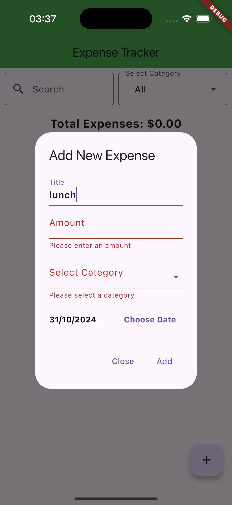
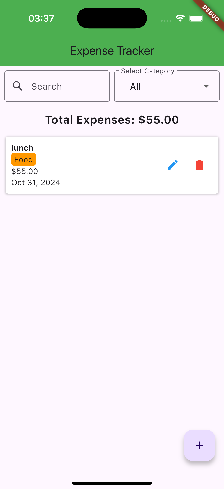
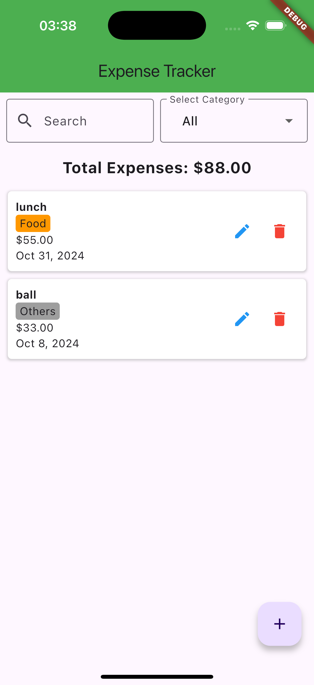
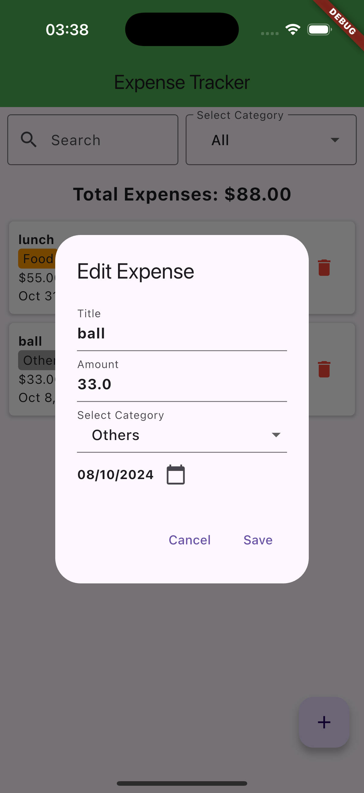

# Altech_flutter_coding_assessment

Expense Tracker Application

## Objective

Develop a simple Expense Tracker application using Flutter that allows users to
manage their expenses efficiently.

## Functional Requirements
1. Add expense
- Users can add a new expense with the following fields:
- Amount (numeric input)
- Description (text input)
- Category (dropdown: e.g., Food, Transport, Clothes, Utilities, Others)
- Date (date picker)

2. View Expenses
- Expenses should be displayed in reverse chronological order (most recent
  first).
- Add a search text field and category dropdown for filtering.

3. Edit Expense
- Users can edit an existing expense. The same fields should be available for
  editing.

4. Delete Expense
- Users can delete an expense from the list.

5. Total Expenses
- Display the total expenses at the top of the expense list.

6. Persistence
- Display the total expenses at the top of the expense list.
- Use local storage (e.g., `shared_preferences` or similar) to persist
  expenses across app restarts.

## Non-Functional Requirements
- UI/UX: The application should have a clean and user-friendly interface.
- Responsiveness: You may only handle the portrait orientation of mobile
  phones.
## Technical Requirements
- Use Flutter with any suitable packages.
- Implement state management (e.g., provider, riverpod, bloc, etc).
- Handle form validation for inputs (e.g., required fields, numeric validation for
  amount).
## Submission Instructions
- Upload the codebase to a public repository (e.g., GitHub)
- Include a README.md file with instructions on how to run the application.

## How To Run
- Clone the Project 
- Run flutter clean and after flutter run
- Tested On IOS Simulator 18.1 only

